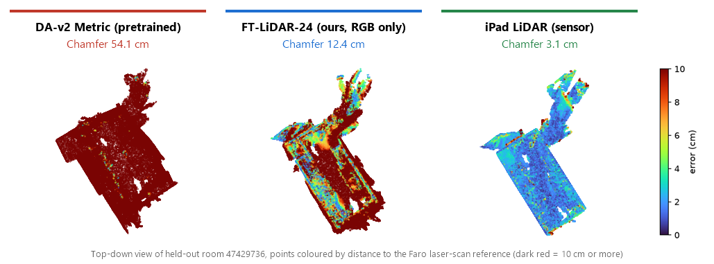
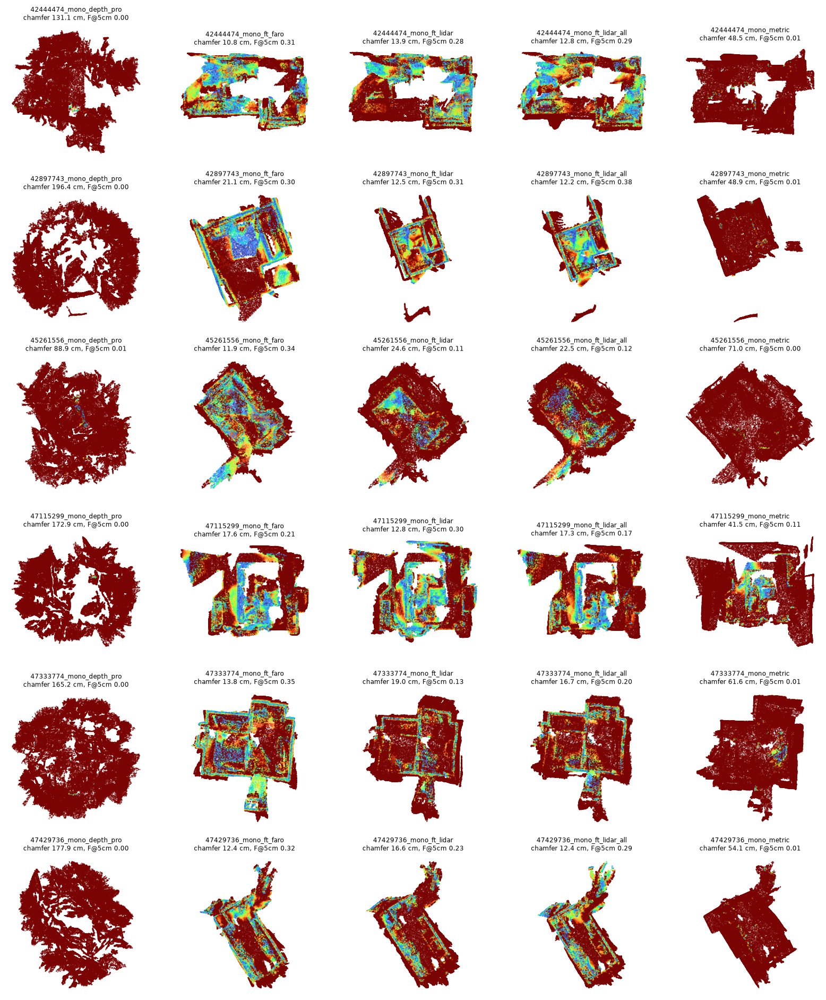
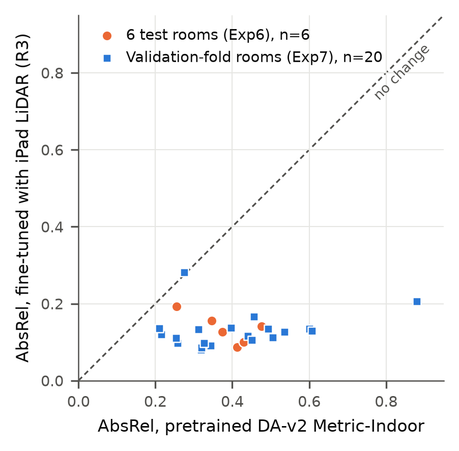
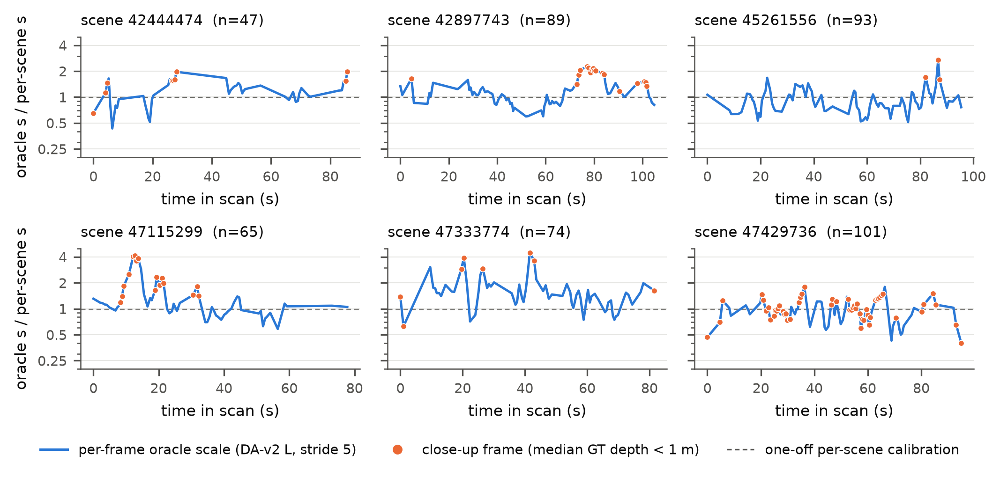
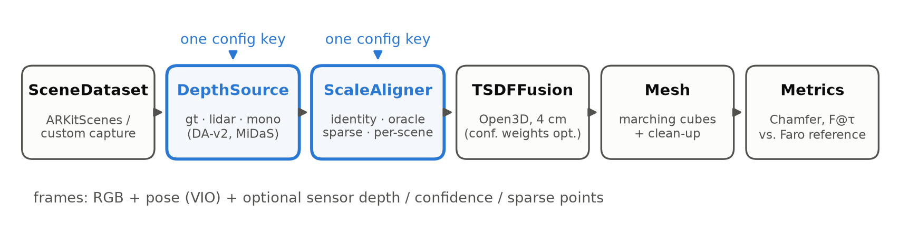

<h1 align="center">roomscan</h1>

<p align="center">
  <b>Scan a room into a 3D model with an ordinary phone camera, then measure how many centimetres it is off.</b><br>
  Monocular depth → TSDF voxel grid → 3D room mesh, evaluated against a Faro laser scanner
</p>

<p align="center">
  
  
  
  
  
</p>

<p align="center">
  
  
  <br>
  <sub>Images from <a href="https://github.com/apple-aiml-research/ARKitScenes">ARKitScenes</a> (Apple), the dataset this repo uses: a person walks around a room filming with an iPad, and the room is reconstructed in 3D. These images are not output of this repo.</sub>
</p>

---

## What this repo does

To reconstruct a room in 3D you need to know how far each pixel is from the camera, in metres. This is called
**depth**. Pro-model iPhones and iPads have a LiDAR sensor that measures depth directly, but most phones do not, so
they have to rely on **monocular depth**: a deep-learning model that guesses depth from a single colour image.

This repo is both the code of a research paper and the backend of an MVP. It builds a single room-reconstruction
pipeline and **changes only where the depth comes from** (Faro laser, iPad LiDAR, or a monocular model) while
everything else stays fixed, then measures how many centimetres the resulting mesh is off from the real room.
The main question (ADR-014) is:

> If we fine-tune a monocular model using only the iPad's own LiDAR depth, with no laser scanner at all,
> does it become more accurate than its pretrained self when measured against Faro?

<p align="center">
  
</p>

**Short answer:** the off-the-shelf Depth Anything V2 Metric-Indoor model misplaces the room by **54.3 cm** on
average, because it predicts depth 1.18–1.45× too far. **FT-LiDAR-24**, which we fine-tuned with iPad LiDAR from
24 rooms, brings this down to **15.7 cm** (3.5× better, and better in all six test rooms) using only RGB images at
run time, with no sensor and no calibration. It still trails real LiDAR (**3.0 cm**) because the predicted scale
swings from view to view, which fine-tuning does not fix.

## Results

Mean ± standard deviation over six rooms never used for training (4 cm voxels).
**Chamfer distance** is the mean distance from each point on the reconstructed mesh to the nearest point on the Faro
reference mesh, and back (lower is better).
**F@5cm** is the fraction of the surface that lies within 5 cm of the real one (higher is better).

| Depth source | Needed at run time | Chamfer (cm) ↓ | F@5cm ↑ |
|---|---|---:|---:|
| Faro laser depth (upper bound) | laser scanner | 2.1 ± 0.5 | 0.97 |
| iPad LiDAR | LiDAR sensor | 3.0 ± 0.6 | 0.93 |
| DA-v2 Large + oracle scale | true scale every frame (a ceiling, not usable in practice) | 5.3 ± 1.3 | 0.79 |
| DA-v2 Large + sparse points | ~200 3D points per frame ¹ | 6.0 ± 1.7 | 0.74 |
| **FT-LiDAR-24 (ours)** | **RGB only** | **15.7 ± 4.0** | **0.24** |
| DA-v2 Large + per-scene scale | one calibration per room | 22.9 ± 2.1 | 0.23 |
| DA-v2 Metric-Indoor (pretrained) | RGB only | 54.3 ± 10.6 | 0.03 |

<sub>¹ These points are sampled from LiDAR as a stand-in for ARKit/ARCore VIO points (ADR-011), so this row is an <b>upper bound</b> of real VIO.</sub>

On per-frame depth over another 20 rooms from the Validation fold, **AbsRel** (mean relative depth error) drops
from 0.410 to 0.130 and improves in 19 of 20 rooms. Full tables live in `experiments/results/<exp>/table.md`.

<details>
<summary><b>More figures</b>: every room × every model, per-room AbsRel, scale drift over time</summary>
<br>

**Every room in Exp6** (columns: Depth Pro, FT-Faro, FT-LiDAR, FT-LiDAR-24, pretrained)



**AbsRel before and after fine-tuning.** Every point below the dashed line is a room where the fine-tuned model is better.



**The scale needed to make each frame's depth correct.** A perfect model would sit flat at 1; in practice it swings by more than 2×, especially when the camera is close to an object (orange dots).



</details>

## How it works

<p align="center"></p>

1. **SceneDataset** reads frames from a video: RGB images, camera poses from VIO, and sensor depth when available (both ARKitScenes and captures recorded by our app are supported).
2. **DepthSource** provides per-frame depth and is the single variable of the experiment: `gt` (Faro), `lidar` (iPad) or `mono` (Depth Anything V2, MiDaS, Depth Pro, fine-tuned models).
3. **ScaleAligner** corrects the scale of monocular depth: `identity` (no correction), `oracle`, `sparse_points`, `per_scene`.
4. **TSDFFusion** fuses all frames into a TSDF (truncated signed distance function) voxel grid with Open3D, and marching cubes extracts the surface as a mesh.
5. **Metrics** compares the mesh with a reference mesh built from Faro depth: Chamfer, F-score, and 2D depth metrics.

Each stage is chosen by a single config key, and `pipeline.py` contains no Open3D, torch or file-format code.
The reasoning behind every design decision is in [docs/architecture/](docs/architecture/README.md) (ADR-001 to ADR-014).

## Getting started

### 1. Install

```bash
make setup
```

This creates `./.venv` (Python 3.12) and installs everything. If you do not need monocular models yet, `make setup-gt` skips torch.

### 2. Try the whole pipeline without downloading data

```bash
make synthetic
```

```bash
make smoke
```

`make synthetic` writes a synthetic room in the ARKitScenes layout (~90 MB, 60 frames) to `data/synthetic/`, and
`make smoke` runs every depth source on it and builds the tables. This room only checks that the code is wired
correctly; **never report its numbers as results**. `make test` runs all unit tests without real data and without torch.

### 3. Run on real data

Download ARKitScenes following [data/README.md](data/README.md) (about 4–7 GB per room), then:

```bash
make reference
```

```bash
make run-lidar
```

`make reference` builds `reference_mesh.ply` from Faro depth (once per room); then run whichever depth source you
want. For a single run with config overrides:

```bash
roomscan run --config configs/depth/gt.yaml --set fusion.voxel_size=0.02
```

### 4. Open the web UI

```bash
make capture-zip SCENE=47429736
```

```bash
make web
```

`make capture-zip` exports a room as a zip in the format our app records (`rgb/`, `poses.json`, `intrinsics.json`,
plus `depth/` and `confidence/` when available). Then open <http://localhost:8765>, upload the zip, pick a depth
source, and orbit the resulting mesh in the browser.

<details>
<summary><b>All Makefile targets</b></summary>

| Command | What it does |
|---|---|
| `make sanity` | turn one frame into a point cloud to inspect in MeshLab |
| `make run-gt` / `run-lidar` / `run-mono` | one room with Faro / LiDAR / monocular + oracle-scale depth |
| `make sweep-exp1` … `sweep-exp6` | every run × every room of an experiment (Exp6 = fine-tuned vs pretrained) |
| `make eval-exp7` | 2D depth metrics only, on 20 Validation-fold rooms |
| `make report` | aggregate all `metrics.json` into `summary.csv` and a `table.md` per experiment |
| `make figures` / `paper-figures` | top-down error, scale-drift and pipeline figures into `paper/figures/` |
| `make train RUN=configs/training/r3_ft_lidar_all.yaml` | fine-tune DA-v2 Metric (needs CUDA, see ADR-013) |
| `make paper` | compile the English manuscript `paper/latex/main.tex` (needs tectonic) |
| `make test` / `lint` | unit tests (no real data needed) / ruff |

A monocular sweep over six rooms takes about 30 minutes; launch it detached (`nohup ... &`), and never run two
sweeps of the same experiment at once, since they overwrite each other's `metrics.json`.

</details>

## Repository layout

```
configs/            base.yaml + depth presets + experiments/exp{0..7}_*.yaml (1 table = 1 file) + training/
src/roomscan/       the package: dataio, depth_sources, models, geometry, evaluation, training
src/roomscan_web/   FastAPI upload/queue API + three.js viewer (imports roomscan, never the reverse)
scripts/            sanity check, reference mesh builder, capture export, figures
tests/              pure-numpy unit tests (no real data, no torch)
experiments/        results/<exp>/<scene>_<run>/{config.yaml, metrics.json}  (meshes not committed)
docs/architecture/  overview + ADR-001..014
paper/              draft/ (Thai), latex/ (English IEEE manuscript + refs.bib), figures/, analysis/
data/               not in git, see data/README.md
```

Results are files: every run commits its `config.yaml` and `metrics.json`, so any number can be traced back to the
config that produced it. Fine-tuned weights live in a private Hugging Face Hub repo, not in git.

## Extending

A new depth source, model, aligner or dataset is one new file plus one registry line. If it requires editing
`pipeline.py`, stop and write an ADR first. Read the invariants (§3) and the dependency rule (§4) in
[docs/architecture/README.md](docs/architecture/README.md) before changing anything in `src/`.

## Status

<details>
<summary>All phases done (updated 2026-09-30)</summary>

| Phase | State |
|---|---|
| 0 loader + sanity | ✅ 6 ARKitScenes rooms, 2,352 Faro frames, 13 GB (42444474 was the development room, the other 5 are held out) |
| 1 GT/LiDAR pipeline, metrics, reference mesh | ✅ Faro 2.1 cm, LiDAR 3.0 cm |
| 2 monocular + scale alignment + 2D metrics | ✅ oracle / per-scene / pretrained metric (ADR-010) |
| 3 sweeps + report | ✅ Exp1–5 on all 6 rooms |
| 4 figures + analysis | ✅ `paper/figures/`, `paper/analysis/scale_drift_summary.md` |
| 5 sparse points + LiDAR confidence | ✅ ADR-011, ADR-012 (confidence weighting does not help: 3.04 → 3.07 cm) |
| 6 web / app capture loader | ✅ `src/roomscan_web/`, `dataio/custom.py` |
| 7 fine-tuning | ✅ R1 FT-Faro, R2 FT-LiDAR, R3 FT-LiDAR-24 (ADR-013), Exp6 + Exp7 (ADR-014) |
| 8 paper | ✅ Thai draft `paper/draft/`, English IEEE manuscript `paper/latex/` |

</details>

## Acknowledgements

- [ARKitScenes](https://github.com/apple-aiml-research/ARKitScenes) (Baruch et al., NeurIPS 2021 Datasets and Benchmarks) for the data and the images above
- [Depth Anything V2](https://github.com/DepthAnything/Depth-Anything-V2), [MiDaS](https://github.com/isl-org/MiDaS) and [Depth Pro](https://github.com/apple/ml-depth-pro) for the depth models
- [Open3D](https://www.open3d.org/) for TSDF fusion and meshing
