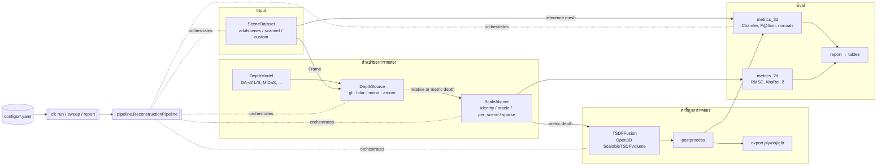

# Architecture — roomscan

> Monocular Depth → TSDF Voxel Grid → 3D Room Mesh, ออกแบบให้ **เปเปอร์กับ MVP เป็นโค้ดชุดเดียวกัน**

ตัวเลือกเชิงสถาปัตยกรรมทุกข้อมี ADR กำกับใน `docs/architecture/adr-*.md` — ถ้าจะเปลี่ยนอะไรที่นี่ ให้เขียน ADR ใหม่ที่ supersede อันเดิม ไม่แก้อันเก่า

## 1. Classification

| | |
|---|---|
| ประเภท | Research pipeline ที่ต้องกลายเป็น product backend ได้ (offline batch) |
| ทีม | 1 คน |
| Timeline | ~10 สัปดาห์ → paper, แล้วค่อย MVP |
| Scale | 3–5 ฉาก, ~1–5k เฟรม/ฉาก, รันบน GPU เครื่องเดียว/Colab |
| ⇒ | **Simple + Modular**: monolith package เดียว, ไม่มี service, ไม่มี DB, abstraction เฉพาะจุดที่เป็นแกนของการทดลอง |

## 2. Component view



## 3. Data flow ต่อเฟรม

```
Frame{rgb, pose_c2w, gt_depth?, extra{lidar_depth, lidar_confidence}}   ← ARKitScenes mapping ใน ADR-009
   │
   ▼  DepthSource.get_depth(frame)             ← สลับได้ (Exp1, Exp4)
pred: (H,W) float32   [metric | relative]
   │
   ▼  ScaleAligner.align(pred, frame)          ← สลับได้ (Exp1)
depth_m: (H,W) float32 metres, 0/NaN = invalid
   │
   ▼  TSDFFusion.integrate(rgb, depth_m, pose) ← voxel_size (Exp2), stride มาจาก dataset.frames() (Exp3)
```

**Invariants** (บังคับใน `types.py` + `pipeline._check_consistency`):
1. หลัง aligner ค่า depth ต้องเป็นเมตรเสมอ
2. `pose_c2w` เป็น camera→world; การ invert เกิดที่ `TSDFFusion.integrate` **ที่เดียว**
3. Intrinsics ผูกกับ resolution — resize รูปแล้วต้อง `Intrinsics.scaled()`
4. DepthSource ที่ `is_metric=True` ต้องคู่กับ `identity` aligner; `is_metric=False` ต้องไม่ใช่ identity

## 4. Module map & dependency rule

```
src/roomscan/
├── types.py            Intrinsics, Frame, Timing            ← ไม่ import อะไรใน package
├── config.py           YAML + _base_ + dotlist overrides
├── _registry.py        string → class (lazy import, GT path ไม่ต้องมี torch)
├── dataio/             SceneDataset ABC + ARKitScenesScene (+ScanNet fallback) ← types
├── models/             DepthModel ABC + DA-v2, MiDaS         ← types
├── depth_sources/      DepthSource ABC + gt/lidar/mono/arcore ← models, types
├── geometry/           backproject, scale_align, tsdf_fusion, postprocess ← types
├── evaluation/         metrics_2d, metrics_3d, report
├── export.py
├── pipeline.py         orchestrator (ห้ามมี Open3D/torch call ตรง ๆ)
└── cli.py              run / sweep / report
```

กฎ: import ไหลลงล่างเท่านั้น (`cli → pipeline → stages → types`) ไม่มี stage ไหน import `pipeline`

## 5. Extension points → สิ่งที่ต้องแตะ

| อยากเพิ่ม | เพิ่มไฟล์ | แก้ registry | แก้ pipeline? |
|---|---|---|---|
| depth source ใหม่ (เช่น ARCore จากมือถือจริง) | `depth_sources/<x>.py` | `depth_sources/__init__.py` | ❌ |
| โมเดล depth ใหม่ (Exp4 / Project 1) | `models/<x>.py` | `models/__init__.py` | ❌ |
| วิธี align scale ใหม่ | class ใน `geometry/scale_align.py` | `build_aligner` | ❌ |
| dataset ใหม่ (ScanNet กลับมา, Replica, ห้องจริง) | `dataio/<x>.py` | `dataio/__init__.py` | ❌ |
| backend TSDF อื่น (GPU) | class ใน `geometry/tsdf_fusion.py` | — | ❌ (interface เดิม) |
| การทดลองใหม่ | `configs/experiments/<x>.yaml` | — | ❌ |

ถ้าการเพิ่มอะไรสักอย่างต้องแก้ `pipeline.py` แปลว่า abstraction รั่ว — ให้หยุดแล้วเขียน ADR

## 6. Experiment ↔ config mapping

| Exp | ตัวแปร | config key | file |
|---|---|---|---|
| 1 Depth source | gt / **lidar** / mono×aligner | `depth.source`, `depth.aligner`, `depth.model` | `exp1_depth_source.yaml` |
| 2 Voxel size | 2/4/8 cm | `fusion.voxel_size`, `fusion.sdf_trunc` | `exp2_voxel_size.yaml` |
| 3 Frame stride | 1/5/10/20 | `dataset.frame_stride` | `exp3_frame_stride.yaml` |
| 4 Model size | L / S / MobileViT | `depth.model` | `exp4_model_size.yaml` |

ทุก run ทิ้ง `config.yaml` + `metrics.json` ไว้ที่ `experiments/results/<exp>/<scene>_<run>/` — `roomscan report` รวมเป็นตาราง

## 7. Phase → module (สถานะ 2026-09-12: 0–4 implemented + tested บน synthetic; ยังไม่แตะข้อมูลจริง)

| Phase | ต้องทำให้ทำงาน | gate |
|---|---|---|
| 0 | `dataio/arkitscenes.py`, `scripts/sanity_check.py` + VERIFY list ใน ADR-009 | point cloud เฟรมเดียว (gt และ lidar) ดูออกว่าเป็นห้อง; 2 เฟรมซ้อนกันได้ |
| 1 | `geometry/tsdf_fusion.py`, `postprocess.py`, `export.py`, `evaluation/metrics_3d.py`, `scripts/build_reference_mesh.py` | `make reference` → `make run-gt` + `make run-lidar` ได้ mesh + ตัวเลข 2 แถวแรกของ Exp1 |
| 2 | `models/depth_anything.py`, `depth_sources/monocular.py`, `scale_align.fit_scale_shift`, `PerSceneAligner.fit`, `metrics_2d.py` | `make run-mono` |
| 3 | `models/midas.py`, `evaluation/report.py` | `make sweep-exp1..4` + `make report` |
| 4 | `per_point_error()` สำหรับ heatmap (ใน metrics_3d) | figures |

**ห้ามข้าม gate ของ Phase 1** — ถ้า GT depth ยังได้ mesh เละ ปัญหาอยู่ที่ pipeline ไม่ใช่โมเดล

## 8. ADR index

| ADR | เรื่อง | สถานะ |
|---|---|---|
| [001](adr-001-depth-source-strategy.md) | DepthSource เป็น strategy interface | Accepted |
| [002](adr-002-scale-alignment-separate-stage.md) | แยก ScaleAligner ออกจาก DepthSource | Accepted |
| [003](adr-003-scene-dataset-abstraction.md) | SceneDataset abstraction (ScanNet ไม่ hardcode) | Accepted |
| [004](adr-004-open3d-backend.md) | Open3D เป็น 3D backend | Accepted |
| [005](adr-005-config-driven-experiments.md) | YAML + OmegaConf, ไม่ใช้ Hydra | Accepted |
| [006](adr-006-results-layout.md) | ผลการทดลองเป็นไฟล์ flat, ไม่มี DB/tracker | Accepted |
| [007](adr-007-src-layout-single-package.md) | `src/` layout, package เดียว, ไม่แยก repo | Accepted |
| [008](adr-008-pretrained-inference-only.md) | ใช้โมเดล pretrained, ไม่เทรน | Accepted |
| [009](adr-009-dataset-arkitscenes.md) | **ARKitScenes** แทน ScanNet + วิธีสร้าง reference mesh | Accepted |

## 9. สิ่งที่ตั้งใจ *ไม่* ทำตอนนี้

- ❌ Web API / queue / three.js viewer — Phase 6 หลังส่งเปเปอร์; วางไว้เป็น package แยก (`roomscan_web/`) ที่ import `roomscan.pipeline`
- ❌ Experiment tracker (W&B/MLflow) — 3 ฉาก × ~15 run = JSON ก็พอ
- ❌ GPU TSDF — ใส่ได้ทีหลังหลัง interface `TSDFFusion` เดิม
- ❌ Pose estimation (COLMAP/ARKit) — ARKitScenes ให้ pose (VIO) มาแล้ว; เป็นงานของ `dataio/custom.py` ตอน MVP
- ❌ Depth upsampling / confidence-weighted fusion — น่าสนใจกับ ARKit confidence map แต่เป็นอีกเปเปอร์
